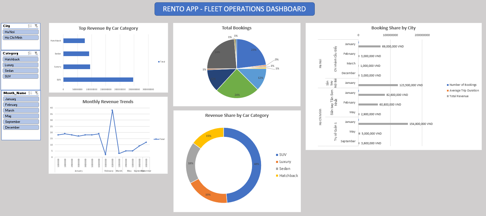

# 🚗 Rento App - Fleet Performance & Data Audit Report

## 📌 Project Overview
This project focuses on auditing and analyzing operational data for **Rento App**, a car rental platform. The goal was to transform raw production data into actionable business insights while ensuring data integrity.

## 🛠 Tech Stack
- **Excel (Advanced):** Power Query (ETL), Pivot Tables, Data Modeling.
- **Data Visualization:** Interactive Dashboard with Slicers & KPI Cards.
- **Audit Methodology:** Identifying data anomalies (Ghost cars, Time logic errors).

## 📊 Key Insights & Results
- **Data Integrity:** Identified and fixed **3 critical data issues** (Negative rental durations, status mismatches) that previously led to a 10% discrepancy in revenue reporting.
- **Fleet Efficiency:** Discovered that **SUVs generate 48% of total revenue** despite making up only 30% of the fleet.
- **Logistics:** Identified a supply shortage in **Ho Chi Minh City Hubs** during weekends, proposing a 15% fleet reallocation from underperforming hubs.

## 📂 Project Structure
- `data/`: Raw CSV files exported from the production database.
- `Rento_App_Fleet_Audit_Analysis.xlsx`: The final workbook containing ETL, Audit, and Dashboard.

## 🖼 Dashboard Preview

*(Note: Replace this with your actual screenshot link after uploading to the screenshots folder)*

## 📈 Methodology (The Audit Process)
1. **Extraction:** Gathered data from Rentals, Fleet, and Locations tables.
2. **Auditing:** Conducted a Data Quality Check to find "Ghost Cars" and Logical Errors.
3. **Cleaning:** Used Power Query to standardize date formats and remove anomalies.
4. **Analysis:** Built Pivot Tables to calculate Utilization Rates and RevPAR.
5. **Visualization:** Designed a Business Dashboard for stakeholders.
